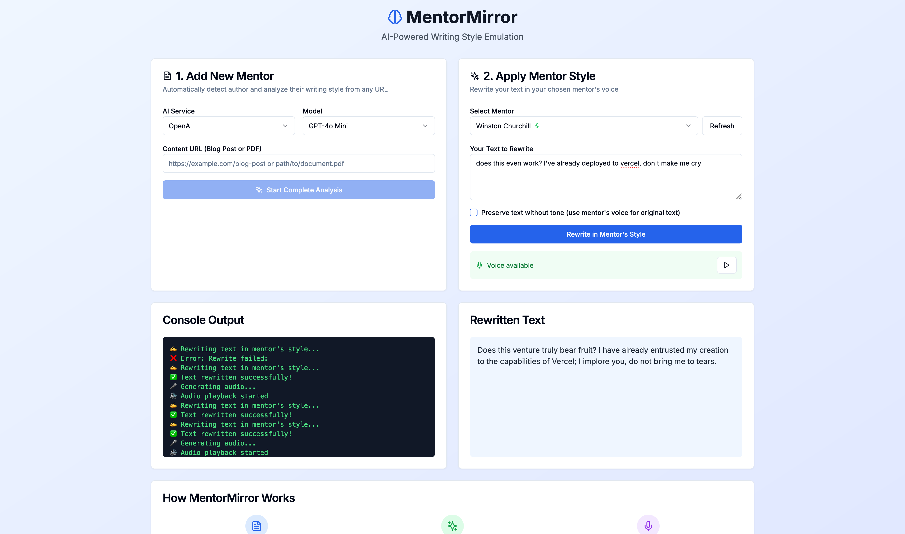

# MentorMirror: AI-Powered Writing Style Emulation

MentorMirror is a desktop application that allows you to scrape the writings of your favorite authors, analyze their unique stylistic patterns, and then apply that style to your own text. It's like having a virtual mentor who can instantly show you how to write in their voice.


## Inspiration
The idea for MentorMirror came from a simple observation: the best writers throughout history learned by studying and imitating masters who came before them. Not everyone has access to personal mentors, and manually analyzing writing styles can take months or years to master.

I envisioned a world where anyone could instantly access the writing wisdom of Paul Graham, the rhetorical power of Winston Churchill, the motivational energy of Andrew Tate, or the lyrical genius of Eminem. What if AI could serve as a bridge between aspiring writers and their literary heroes? What if I could democratize access to the world's greatest writing minds, making their unique voices available to anyone with a computer and an internet connection?

MentorMirror was born from this vision to create a tool that doesn't just analyze text, but truly understands and captures the essence of great communicators, making their wisdom accessible to the next generation of writers.

## What it does
MentorMirror transforms any piece of text content into a personalized writing mentor. Here's how it revolutionizes the writing learning process:

**Content Intelligence**: Simply paste any URL—whether it's a Paul Graham essay, a Churchill speech transcript, or a motivational blog post. MentorMirror automatically extracts and analyzes the content, even handling complex PDFs and multimedia-rich pages using `browser-use`.

**Style DNA Extraction**: The AI engine dissects writing at multiple levels, identifying unique patterns in sentence structure, vocabulary choices, rhetorical devices, emotional tone, and argumentative flow. It creates a comprehensive "style DNA" that captures what makes each author distinctive.

**Intelligent Rewriting**: Enter your own text and watch as MentorMirror transforms it into the voice of your chosen mentor. Your ideas remain intact, but the delivery adopts the mentor's unique linguistic fingerprint, whether that's Graham's analytical clarity, Churchill's stirring oratory, or Eminem's rhythmic intensity.

**Voice Embodiment**: For supported mentors, MentorMirror goes beyond text by generating authentic-sounding speech using ElevenLabs' advanced voice synthesis, allowing you to literally hear your text spoken in your mentor's voice.

## How I built it
MentorMirror represents a sophisticated fusion of multiple cutting-edge technologies, architected for both power and usability:

**Frontend Architecture**: Built on PyQt6, the desktop application provides a responsive, intuitive interface with real-time progress tracking, animated feedback, and seamless workflow management. The GUI handles complex async operations while maintaining a clean, professional user experience.

**AI Integration Layer**: I implemented a flexible dual-provider system supporting both OpenAI (GPT-4o, GPT-4 Turbo, GPT-4o Mini) and Google AI (Gemini models), allowing users to choose the best model for their specific needs and budget constraints.

**Content Processing Pipeline**: My custom scraping engine handles diverse content formats, from simple blog posts to complex PDFs with intelligent text extraction algorithms that preserve structure while filtering out noise.

**Style Analysis Engine**: The core AI system employs advanced natural language processing to identify and quantify stylistic elements including lexical diversity, syntactic complexity, rhetorical patterns, and emotional resonance.

**Voice Synthesis Integration**: ElevenLabs API integration provides high-quality text-to-speech conversion with mentor-specific voice mapping, complete with audio playback controls and background processing.

**Data Architecture**: A robust file organization system automatically manages mentor profiles, session data, and analysis results in a clean, exportable structure that supports easy backup and sharing.

## Challenges I ran into
Building MentorMirror presented numerous technical and conceptual challenges that pushed me to innovate:

**Content Extraction Complexity**: Ib scraping seems straightforward until you encounter the wild variety of content structures online. I had to develop intelligent parsing algorithms that could handle everything from simple blog posts to complex academic PDFs, dynamic JavaScript-loaded content, and multimedia-rich pages. Each site presented unique challenges in extracting clean, meaningful text while preserving important structural elements.

**Author Identity Resolution**: One of my most complex challenges was reliably determining authorship from scraped content. Authors' names might appear in bylines, headers, footers, or be completely absent. I developed sophisticated AI-powered inference systems that analyze content context, writing patterns, and metadata to make educated guesses about authorship, while gracefully handling cases where identification is impossible.

**Style Quantification**: Perhaps the most intellectually challenging aspect was developing algorithms to capture the ineffable qualities that make each writer unique. How do you quantify Churchill's rhetorical power or Paul Graham's analytical clarity? I created multi-dimensional analysis frameworks that examine syntax, semantics, rhythm, and emotional undertones to build comprehensive style profiles.

**Real-time User Experience**: Balancing thorough analysis with responsive user experience required careful engineering. I implemented sophisticated progress tracking, background processing, and cancellation mechanisms to ensure users always feel in control, even during lengthy AI processing operations.

**API Integration Reliability**: Working with multiple AI providers meant handling various API limitations, rate limits, and failure modes. I built robust retry mechanisms, fallback systems, and clear error reporting to maintain reliability across different service providers.

**Voice Synthesis Coordination**: Integrating text-to-speech functionality required managing complex state transitions between text generation, audio synthesis, and playback controls, all while maintaining responsive UI interactions.

## Accomplishments that I'm proud of
MentorMirror represents several significant technical and user experience achievements:

**Seamless End-to-End Automation**: I created a complete workflow that takes users from raw URL to fully analyzed writing mentor in minutes, not hours. The system handles content extraction, author detection, style analysis, prompt generation, and database management automatically, with comprehensive validation at each step.

**Intelligent Duplicate Management**: My smart duplicate handling system automatically resolves conflicts when multiple "unknown" authors are detected, creating clean, organized mentor databases without user intervention.

**Multi-Provider AI Flexibility**: By supporting both OpenAI and Google AI models, we've given users the freedom to choose the best tool for their specific needs and budget, while maintaining consistent functionality across providers.

**Professional-Grade Voice Integration**: The ElevenLabs integration provides remarkably authentic voice synthesis, with intelligent mentor-to-voice mapping that brings text to life in ways that feel genuinely representative of each author's speaking style.

**Robust Error Handling**: I've built a system that gracefully handles the countless ways things can go wrong—from network failures to malformed content to API limitations—while providing clear, actionable feedback to users.

**Scalable Architecture**: The modular design allows for easy expansion, whether adding new AI providers, content sources, or analysis capabilities, ensuring MentorMirror can grow with evolving technologies.

## What I learned

**AI Integration Complexity**: Working with multiple AI providers taught me that each has unique strengths, limitations, and quirks. Building abstractions that work across different models while preserving their individual capabilities requires careful architectural planning and extensive testing.

**User Experience in AI Applications**: I learned that AI-powered applications require different UX patterns than traditional software. Users need clear feedback about what the AI is doing, confidence indicators about result quality, and easy ways to understand and correct AI decisions.

**The Art of Style Analysis**: Quantifying writing style is both more complex and more subjective than initially anticipated. I discovered that effective style analysis requires multiple analytical dimensions and that different authors require different analytical approaches.

**Asynchronous Processing Design**: Managing long-running AI operations while maintaining responsive UI required sophisticated threading, progress tracking, and cancellation mechanisms. I learned the importance of giving users control and visibility into background processes.

**Content Processing Challenges**: The diversity of online content formats taught me the importance of  parsing algorithms and the value of graceful degradation when perfect extraction isn't possible.

**API Reliability Patterns**: Working with external AI services highlighted the need for comprehensive retry logic, fallback mechanisms, and clear error communication even when external services fail.

## What's next for MentorMirror

My roadmap for MentorMirror includes exciting expansions that will make it even more powerful and accessible:

**Expanded Voice Library**: I'm working to add voice synthesis support for many more mentors, including historical figures, contemporary thought leaders, and international authors, creating a truly global library of writing voices.

**Enhanced Content Sources**: Future versions will support additional content formats including YouTube transcripts, podcast transcriptions, social media posts, and academic papers, dramatically expanding the pool of potential mentors.

**Collaborative Features**: I'm developing sharing capabilities that will allow users to export and share mentor profiles, creating a community-driven library of writing styles and mentorship resources.

**Advanced Analytics**: Enhanced style analysis will include more sophisticated metrics like emotional progression, argument structure analysis, and comparative style evolution over time.

**Multi-Language Support**: International expansion will include support for analyzing and emulating writing styles in multiple languages, opening up global literary traditions.

**Integration Ecosystem**: I'm planning integrations with popular writing tools like Notion, Google Docs, and Grammarly, allowing users to apply mentor styles directly in their existing workflows.

**Educational Partnerships**: I'm exploring partnerships with educational institutions to create structured writing curricula built around MentorMirror's mentorship capabilities.

**Mobile Applications**: Native mobile apps will bring MentorMirror's capabilities to smartphones and tablets, making mentorship accessible anywhere inspiration strikes.


## Features

- **Intelligent Content Scraping**: Ingest content from any URL (blog posts, articles, and even PDFs).
- **Automatic Author Detection**: Uses AI to automatically infer the author's name from scraped content.
- **Smart Duplicate Handling**: Automatically handles duplicate "Unknown Author" entries with numerical suffixes (Unknown Author 1, Unknown Author 2, etc.).
- **Comprehensive Style Analysis**: Analyzes text for tone, voice, sentence structure, vocabulary, and rhetorical patterns.
- **Complete Workflow Automation**: Generates style analysis, mentor prompts, and session summaries in one go.
- **Organized File Structure**: All mentor data is organized in a clean `mentors/` folder structure.
- **Visual Progress Tracking**: Real-time animated progress indicators show each step of the analysis workflow.
- **Error Handling & Validation**: Robust error detection with comprehensive file validation.
- **Style Rewriting**: Enter your own text and have the application rewrite it in any saved mentor's style.
- **Flexible Model Selection**: Supports both OpenAI and Google language models.
- **Intuitive GUI**: A streamlined desktop application built with PyQt6.
- **Text-to-Speech Integration**: Voice playback for supported mentors using ElevenLabs API.
- **Interactive Controls**: Play/pause audio controls and cancel operations mid-process.

## How It Works

The system consists of four main Python scripts working together:

1.  **`mentor_mirror_gui.py`**: The main desktop application with animated progress tracking and streamlined interface.
2.  **`url2txts.py`**: A powerful scraper that extracts text content from web pages and PDF files.
3.  **`style_emulation_system.py`**: The core AI engine for style analysis, author inference, and text rewriting.
4.  **`mentor_mirror_pipeline.py`**: The backend orchestrator that runs the complete analysis workflow.

## Complete Workflow

When you add a new mentor, the system automatically performs these steps:

1. **Content Scraping**: Downloads and extracts text from the provided URL
2. **Author Inference**: Uses AI to automatically detect the author's name from the content
3. **Style Analysis**: Analyzes writing patterns, tone, vocabulary, and structure
4. **Mentor Prompts**: Generates specialized prompts for different mentoring scenarios
5. **Mentor-gram Creation**: Creates daily inspiration content in the author's voice
6. **Session Summary**: Builds a comprehensive summary of the analysis
7. **Database Update**: Adds the mentor to the central database

Each step includes validation to ensure all files are properly generated and contain valid data. The progress bar provides real-time animated feedback during processing.

## File Organization

All mentor data is organized in a clean folder structure:

```
MentorMirror/
├── mentors/                    # Main mentors directory
│   ├── mentors.json           # Central database of all mentors
│   ├── styles/                # Individual style analysis files
│   │   ├── paul_graham.json
│   │   ├── warren_buffett.json
│   │   ├── unknown_author_1.json
│   │   └── ...
│   └── sessions/              # Individual analysis sessions
│       ├── session_paul_graham_2025-01-15_14-30-25/
│       │   ├── style_analysis.json
│       │   ├── mentor_prompts.json
│       │   ├── mentorgram_2025-01-15.json
│       │   └── session_summary.json
│       └── ...
└── scraped_content_*/         # Temporary scraping directories
    ├── content.txt
    ├── content.json
    └── ...
```

## Getting Started

### Prerequisites

- Python 3.8+
- An OpenAI API key and/or a Google AI API key
- An ElevenLabs API key (optional, for text-to-speech features)

### Installation

1.  **Clone the repository:**
    ```bash
    git clone <repository_url>
    cd MentorMirror
    ```

2.  **Install dependencies:**
    ```bash
    pip install -r requirements.txt
    ```

3.  **Set up your API keys:**
    Copy the environment template and add your keys:
    ```bash
    cp env_template.txt .env
    ```
    Then edit `.env` with your actual API keys:
    ```
    OPENAI_API_KEY="sk-..."
    GOOGLE_API_KEY="..."
    ELEVENLABS_API_KEY="..."  # Optional, for voice features
    ```

### Running the Application

Launch the MentorMirror Control Panel:

```bash
python3 mentor_mirror_gui.py
```

## User Guide

### Adding a New Mentor (Streamlined Workflow)

1.  **Configure AI Settings**: Select your preferred AI service (OpenAI or Google) and model at the top of the "Add New Mentor" section.

2.  **Read the Guide**: The "How MentorMirror Works" section right above the URL field explains the process.

3.  **Enter Content URL**: Paste any URL in the Content URL field:
    - Blog post URLs (e.g., `https://paulgraham.com/essay.html`)
    - PDF URLs (e.g., `https://example.com/document.pdf`)
    - Local file paths

4.  **Start Analysis**: Click "Start Complete Analysis" to begin the automated workflow.

5.  **Monitor Progress**: Watch the animated progress bar and step indicators:
    - Progress bar shows overall completion with smooth animation
    - Checkboxes indicate completed steps
    - Console shows detailed output and any errors
    - Use the cancel button to stop operations if needed

6.  **Review Results**: If successful, the new mentor will be automatically added to your database and available in the dropdown.

### Applying a Mentor's Style

1.  **Select a Mentor**: Choose from the dropdown (click "Refresh" if needed)
2.  **Enter Your Text**: Type or paste your text in the text box
3.  **Rewrite**: Click "Rewrite in Mentor's Style" 
4.  **View Results**: The rewritten text appears in the console output
5.  **Listen (Optional)**: For supported mentors like Eminem, a play button will appear to hear the text spoken in their voice. The button automatically resets when audio finishes playing.

The rewritten text preserves your original message while adopting the mentor's tone, vocabulary, and writing patterns.

## Smart Features

### Automatic Duplicate Handling

When the system encounters multiple "Unknown Author" entries, it automatically creates unique identifiers:
- First unknown: "Unknown Author 1"
- Second unknown: "Unknown Author 2"
- And so on...

This prevents conflicts and maintains a clean mentor database.

### Animated Progress Tracking

The progress bar provides visual feedback with smooth animations during processing, making it clear when the system is actively working versme completed.

### Organized File Management

All mentor-related files are automatically organized in the `mentors/` directory, keeping your workspace clean and making it easy to backup or share your mentor collection.

### Voice Integration

Some mentors support text-to-speech playback meing ElevenLabs' AI voice technology:
- **Eminem**: Mapped to a specific voice model for authentic delivery
- **Play/Pause Controls**: Appear automatically when voice is available
- **Background Processing**: Audio generation happens in a separate thread
- **Cancel Operations**: Stop any running process mid-execution with the cancel button

## Error Handling

The application includes comprehensive error handling:

- **File Validation**: All generated JSON files are validated for completeness and proper structure
- **Step-by-Step Tracking**: Each workflow step is individually monitored with clear success/failure indicators
- **Clear Error Messages**: Detailed console output helps identify and resolve issues
- **Graceful Degradation**: Failed steps don't crash the entire workflow

## Troubleshooting

**Q: The author name detection shows "Unknown Author 1, 2, etc."**
A: This happens when the AI cannot confidently identify the author from the content. The system automatically creates unique identifiers to prevent conflicts. You can manually edit the mentor name in the JSON file if needed.

**Q: Some steps are failing during analysis**
A: Check the console output for specific error messages. Ensure your API keys are valid and you have sufficient credits/quota.

**Q: The mentor dropdown is empty**
A: Click the "Refresh" button or ensure you've successfully completed at least one full analysis workflow.

**Q: Can I add the same author multiple times?**
A: Yes, subsequent analyses will update the existing mentor entry. The system mees the inferred author name as the unique identifier.

**Q: The play button doesn't appear after rewriting text**
A: Voice playback is only available for specific mentors (currently Eminem). Make sure you have an ElevenLabs API key in your `.env` file and have selected a supported mentor.

**Q: I get a TTS error when trying to play audio**
A: Check that your ElevenLabs API key is valid and you have sufficient credits. The error message in the console will provide specific details.

## Advanced Usage

### Command Line Interface

You can also run the backend directly:

```bash
# Run complete analysis
python3 mentor_mirror_pipeline.py --service openai --model gpt-4o-mini complete --content-file path/to/content.txt

# Rewrite text
python3 mentor_mirror_pipeline.py --service google --model gemini-2.0-flash rewrite --mentor-name "Warren Buffett" --input-text "Your text here"
```

### Cmetomizing Models

The GUI supports multiple AI models. Choose based on your needs:
- **GPT-4o Mini**: Fast and cost-effective for most tasks
- **GPT-4o**: Higher quality analysis for complex writing styles  
- **GPT-4 Turbo**: Enhanced capabilities for sophisticated analysis
- **Gemini Models**: Alternative provider with different strengths and pricing

### File Management

The organized folder structure makes it easy to:
- **Backup**: Simply copy the entire `mentors/` folder
- **Share**: Export specific mentor styles by sharing individual JSON files
- **Migrate**: Move the `mentors/` folder to different installations

Enjoy building your personal collection of writing mentors with MentorMirror!